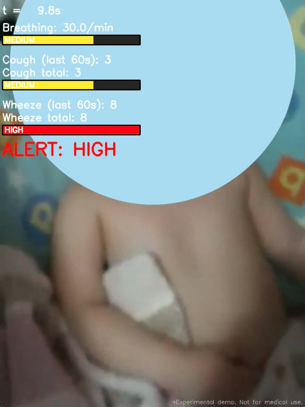

# RespGuard — Early Breathing Distress Prototype

> ⚠️ **Not a medical device.**  
> Research / hackathon prototype only.  
> Must **not** be used for diagnosis or safety-critical decisions.

RespGuard is an experimental prototype that analyzes **cough, wheeze and breathing patterns** directly from ordinary **video + audio** – no wearables, chest straps or extra sensors.
The goal: explore what **early warning signals** could look like if a baby camera could “understand” how a child breathes at night.

---

## 🎬 Demo

Short demo of the dashboard overlay (turn on the sound):



---

## 🔒 Privacy & Child Safety

This prototype uses *publicly available* videos of children with strict privacy protections:

- the child’s **face is fully masked** with a solid light-blue circle;
- the original voice is **pitch-shifted by +4 semitones**.

These transformations aim to hide biometric and personally identifiable features while keeping respiratory sounds (coughs, wheezes, breathing patterns) **acoustically intact enough for analysis**.

---

## 🌟 What RespGuard Does

For each input `.mp4` video, RespGuard:

1. **Extracts audio** from the video.
2. Computes simple audio features:
   - **Cough level** — onset “spikes” in the signal.
   - **Wheeze level** — mid-band spectral energy (≈ 400–2000 Hz) vs low frequencies.
   - **Breathing rate** — cycles in a smoothed RMS envelope (breaths/min).
3. Tracks **episodes per last 60 seconds** (cough & wheeze) with a sliding time window.
4. Combines them into a simple **RISK ALERT**: `LOW` / `MEDIUM` / `HIGH`.
5. Renders a **visual dashboard overlay** on top of the video:
   - three risk bars: **BREATH**, **COUGH**, **WHEEZE**;
   - counts of total & recent episodes;
   - large status line (`ALERT: HIGH` / `STATUS: OK`);
   - small disclaimer: `Experimental demo. Not for medical use.`

Output: a processed `.mp4` with the dashboard overlay and original audio.

---

## 🛠 Quick Start

```bash
# 1. Clone the repo
git clone https://github.com/NadezhdaSmurova/RespGuard.git
cd RespGuard

# 2. Install dependencies
pip install -r requirements.txt

# 3. Run the prototype on example videos
python RespGuard.py
By default:
Input: examples/input/
Output: examples/output/
```

Example mapping:

input:   examples/input/video.mp4

output:  examples/output/output_video.mp4

You can also point the script to your own .mp4 files by placing them into examples/input/ or adapting the arguments (when you move to a CLI module).

📂 Repository Structure


RespGuard/

  RespGuard.py          # main prototype script

  examples/

    input/              # put test .mp4 videos here

    output/             # processed videos with overlay
 
 assets/
 
   demo.mp4            # short demo clip
 
 requirements.txt
 
 README.md

(In the future this will be split into modules like audio_features.py, overlay.py, pipeline.py, etc.)

🧠 Risk Logic (Prototype)

RespGuard uses very simple, hand-tuned thresholds. They are experimental, not clinically validated.

HIGH risk if any of the following:

cough episodes ≥ 2 / minute, or

wheeze episodes ≥ 6 / minute, or

breathing rate > 35 / minute.

MEDIUM risk if any of:

cough episodes ≥ 1 / minute, or

wheeze episodes ≥ 2 / minute, or

breathing rate in [30, 35] / minute

LOW risk otherwise.

These values are chosen purely for demo & research and should not be used in real medical decisions.

📌 Project Status & Next Steps

Current prototype:

✅ Audio-based analysis of cough, wheeze and breathing rate from video.

✅ Sliding window episode counting (last 60 seconds).

✅ Visual dashboard overlay with per-parameter risk bars.

✅ Works offline on stored .mp4 files.

Planned directions:

🔜 Integration with live IP cameras (e.g. Tapo, RTSP stream).

🔜 Replacement of handcrafted thresholds with trained ML models for cough/wheeze detection.

🔜 More robust breathing-rate estimation on diverse real-world data.

🔜 Better configuration & sensitivity profiles (e.g. “conservative” vs “sensitive”).

⚠ Disclaimer (Important)

RespGuard is a concept prototype created for research, experimentation and hackathons.

It is not a medical device.

It does not provide medical diagnoses or treatment recommendations.

It must not be used for monitoring or safety-critical decisions for children or adults.

Always consult qualified medical professionals for any health-related concerns.